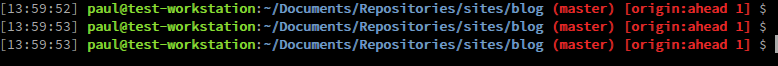

# Bash Extensions

My bash extensions that speed up setting up and using local setups and git


## Command list
[Commands List](commands.md)


## Installation
### Main
Add these lines into ~/.bashrc, replacing ```<<<you repo location>>>``` with the location of your repo

```bash
if [ -d <<<you repo location>>> ]; then
    for file in <<<you repo location>>>/*.sh ; do
         . ${file}
    done
fi
# for the bash arguments auto completion
if [ -d <<<you repo location>>>/bash-completion ]; then
    for file in <<<you repo location>>>/bash-completion/*.sh ; do
         . ${file}
    done
fi
```
update the mysql-connection-details.txt file with your mysql login details

### Terminal Git Prompt


Shows the below information:
- time
- git branch
- git remote
- number of commits ahead or behind
- git tags

add to ~/.bashrc before the above code
```bash
yorick_prompt=true # true|false
yorick_color_prompt=true # true|false
yorick_git_prompt=true # true|false
yorick_time_prompt=true # true|false
```

#### settings
set to true or false

| Command                 |                     |
| ----------------------- |:-------------------:|
| yorick_color_prompt     | use colour          |
| yorick_git_prompt       | show git details    |
| yorick_time_prompt      | show the time       |


#### Vhosts
make a vhosts file called httpd-vhosts.conf in your apache installation
make the vhosts file and  /etc/hosts is editable by your user without sudo

### Git auto complete
This is not written by me but is really useful

To allow git autocomplete to work run
```
curl https://raw.githubusercontent.com/git/git/master/contrib/completion/git-completion.bash -o ~/.git-completion.bash
```

and add the bellow code just above the code we added in ~/.bashrc
```bash
if [ -f ~/.git-completion.bash ]; then
  . ~/.git-completion.bash
fi
```
